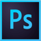

# 设计资源

----

这里提供 WeUI Design 相关设计资源和设计工具的下载，更多设计资源正在整理和完善中。

  

    <a href="https://wximg.gtimg.com/shake_tv/mina/WEUI_1_0_161226_Sketch.zip" target="_blank" class="flex flex-middle">
      
        
      
      
        Sketch Template
        WeUI Sketch组件库
      
    </a>
  

  

    <a href="https://wximg.gtimg.com/shake_tv/mina/WeUI1.0.psd.zip" target="_blank" class="flex flex-middle">
      
        
      
      
        Photoshop Template
        WeUI PS组件库
      
    </a>
  

